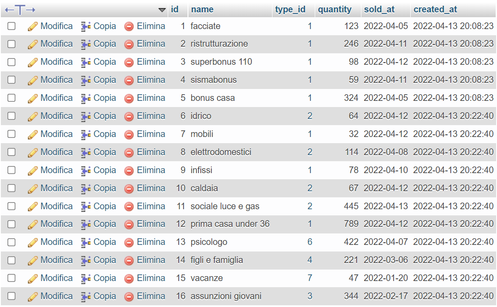
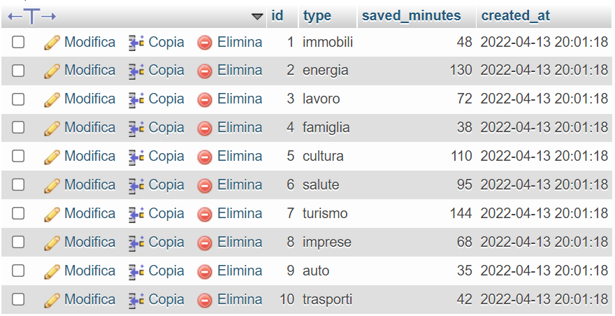

<p align="center">

  <h3 align="center">BONNY - State bonus PHP REST API</h3>

  <p align="center">
    This is my first project in php and MySQL. It is a simple REST API for the fake startup Bonny, a company whose purpose is to facilitate citizens' access and understanding of Italian state bonuses.
  </p>

</p>

<details open="open">
  <summary><h2 style="display: inline-block">Table of Contents</h2></summary>
  <ol>
    <li>
      <a href="#about-the-project">About The Project</a>
      <ul>
        <li><a href="#built-with">Built With</a></li>
      </ul>
    </li>
    <li>
      <a href="#getting-started">Getting Started</a>
      <ul>
        <li><a href="#prerequisites">Prerequisites</a></li>
        <li><a href="#installation">Usage</a></li>
      </ul>
    </li>
    <li><a href="#license">License</a></li>
    <li><a href="#links-contacts">Links & Contacts</a></li>
  </ol>
</details>

## About The Project

This is a REST API developed in php and MySQL with which you can find information regarding the Italian state bonuses of 2022 and their types.
User can perform:

<ul>
<li> <strong>GET</strong> request: to find data relating to state bonuses, with or without filter systems (bonus category and date-range); </li>
<li> <strong>GET</strong> request: to find data relating to state bonuses type; </li>
<li> <strong>GET</strong> request: to find the data relating to the total number of minutes saved by bonus category for using the service offered by Bonny; </li>
<li> <strong>GET</strong> request: to find the data relating to the bonus category with max number of saved minutes for using the service offered by Bonny; </li>
<li> <strong>POST</strong> request: to create new bonuses; </li>
<li> <strong>POST</strong> request: to create new bonuses type; </li>
<li> <strong>PUT</strong> request: to update existing bonuses; </li>
<li> <strong>PUT</strong> request: to update existing bonuses type; </li>
<li> <strong>DELETE</strong> request: to delete existing bonuses; </li>
<li> <strong>DELETE</strong> request: to delete existing bonuses type; </li>
</ul>

<br>

<p>This is a preview of the MySQL tables: bonus_list and bonus_type:</p>




### Built With

- [php](https://www.php.net/)
- [MySQL](https://www.mysql.com/)

## Getting Started

### Prerequisites

Running the application requires Web Server (e.g., Apache) PHP and MySQL to be installed on your operating system. You can also use an integrated solution to run local web server, php and MySQL all in once, such as, for example, [XAMPP](https://www.apachefriends.org/it/index.html).

### Usage

1. Clone the repository locally with the git command:

   ```sh
   git clone https://github.com/Auro-93/bonny-state-bonus-rest-api.git
   ```

2. Create a <strong>config.php</strong> file in the project root, following the pattern that you can find in the <strong>config.example.php</strong> file. Replace the example values ​​with your own data. For example:

   ```sh
   return [

    "host" => "mysql:host=127.0.0.1",
    "db_name" => "state_bonus",
    "username" => "root",
    "password" => "1234",

    ];

   ```

3. To recreate the database follow the scheme you can find in the file <strong>migration_script.sql </strong>

## License

Distributed under the MIT License. See `LICENSE` for more information.

## Links & Contacts

[@Aurora Sirigu](https://www.linkedin.com/in/aurora-sirigu-a001301b4/) - 93a.sirigu at gmail dot com

Project Repository: [bonny-state-bonus-rest-api](https://github.com/Auro-93/bonny-state-bonus-rest-api)

Portfolio: [aurodev-web-developer-portfolio](https://aurodev-web-developer-portfolio.netlify.app/)
